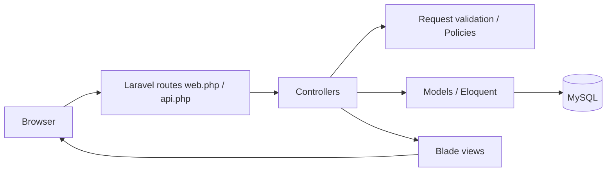
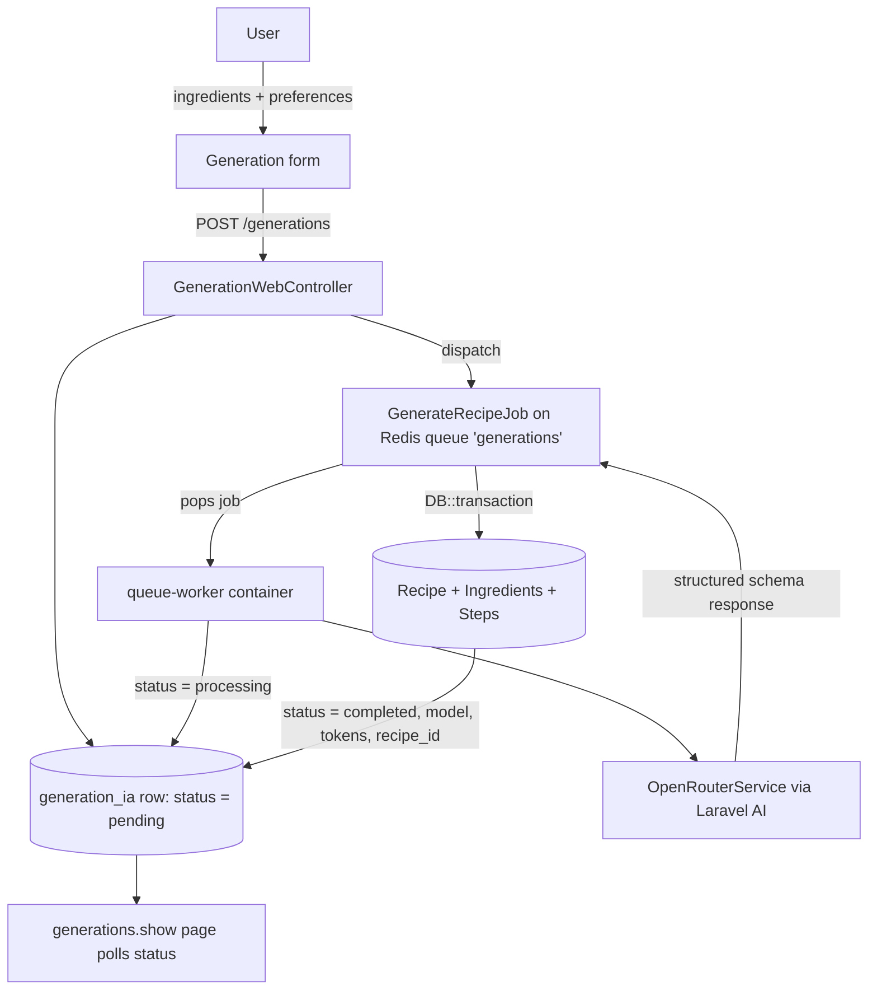

# 🍳 AI RecipeKeeper

An AI-powered recipe management platform built with Laravel. Create, browse, review and favorite recipes — or let an AI generate a complete, structured recipe from a list of ingredients.

---

## 📖 Table of contents

- [Project description](#-project-description)
- [Screenshots](#-screenshots)
- [Features](#-features)
- [Technology stack](#-technology-stack)
- [System architecture](#-system-architecture)
- [Architecture / MCD / MLD documentation](#-architecture--mcd--mld-documentation)
- [Project modules](#-project-modules)
- [AI recipe generation](#-ai-recipe-generation)
- [Database](#-database)
- [Installation](#-installation)
- [Docker setup](#-docker-setup)
- [Environment configuration](#-environment-configuration)
- [Running the project](#-running-the-project)
- [Testing](#-testing)
- [CI/CD](#-cicd)
- [Project structure](#-project-structure)
- [OpenSpec](#-openspec)
- [Git workflow](#-git-workflow)
- [Roadmap](#-roadmap)
- [Contributing](#-contributing)
- [License](#-license)
- [Author](#-author)

---

## 📌 Project description

AI RecipeKeeper is a web application that helps home cooks and recipe enthusiasts **store, organize, and generate recipes**.

The problem it solves: recipe collections are scattered across notebooks, screenshots, and websites. AI RecipeKeeper centralizes them in one place and adds a modern twist — an AI chef that builds a complete recipe (ingredients, steps, timing, difficulty) from whatever you have in your fridge.

It is intended for:

- home cooks who want to save and organize their own recipes,
- users who want to discover recipes published by the community,
- anyone who wants to generate a new recipe from a set of ingredients with a few clicks.

The platform covers the full recipe lifecycle:

- **AI recipe generation** — request a recipe from a list of ingredients and preferences; a queued job calls the AI provider and stores the structured result.
- **Recipe management** — create, edit, delete and view your own recipes (title, description, timing, servings, difficulty, image, ingredients, steps, categories).
- **Browsing** — explore published recipes with search and category filtering.
- **Favorites** — save recipes for quick access.
- **Reviews and ratings** — rate and comment on recipes, with average ratings aggregated on recipe pages.
- **Authentication and authorization** — registration, login, per-user ownership policies, and an admin role with a dedicated area.
- **Dashboard** — a personalized landing page with a featured recipe, recent favorites, and shortcuts.

---

## 🖼️ Screenshots

| Authentication | Recipe browsing |
|:---:|:---:|
|  |  |

---

## ✨ Features

| Feature | Description |
|---|---|
| **Authentication** | Register, login, remember-me and logout (session-based, Blade views). |
| **Authorization** | Ownership checks via Laravel Policies (recipes, reviews, favorites, categories, generations) and an `admin` middleware for the admin area. |
| **Admin area** | Admin-only dashboard and full category management (create, edit, delete). |
| **Dashboard** | Personalized home page: greeting, featured recipe with rating, recent favorites. |
| **Recipe management** | Full CRUD for recipes with images, ingredients (with quantity/unit), ordered steps, and categories. AI-generated recipes are flagged. |
| **Browse recipes** | Paginated recipe explorer with **search** (title/description) and **category filtering**. |
| **Recipe details** | Dedicated recipe page: ingredients, step-by-step instructions, category tags, average rating, and favorite toggle. |
| **Categories** | Recipes organized in categories; category pages and filters. |
| **Favorites** | Add/remove favorite recipes, favorites page, and favorite state shown across views. |
| **Reviews and ratings** | Rate (1–5) and comment on recipes; update or delete your own review; average rating and count shown on the recipe page. |
| **AI recipe generation** | Generate a full recipe from ingredients and preferences through a structured AI response, processed asynchronously. |
| **Queue / background jobs** | `generations` Redis queue with a dedicated worker container; retries, backoff and failure recording. |
| **REST API** | Sanctum-protected JSON API for recipes, categories, favorites, reviews and AI generation (token-based). |
| **Demo data seeding** | Seeder catalog with ~35 real French recipes; fresh Docker installs are auto-seeded on first boot. |

---

## 🧰 Technology stack

### Runtime

| Technology | Version | Role |
|---|---|---|
| PHP | ^8.3 (PHP 8.4 in Docker/CI) | Runtime language |
| Laravel | v13.24 | Web framework (monolith, Blade) |
| Blade | — | Server-side templating |
| Tailwind CSS | 4 | Styling (`@tailwindcss/vite`) |
| Vite | 8 | Frontend build tool & HMR dev server |
| MySQL | 8.4 | Primary database (Docker image `mysql:8.4`) |
| Redis | 7 | Queue backend (Docker image `redis:7-alpine`) |
| Laravel Sanctum | v4.3 | API token authentication |
| Laravel AI | v0.10 | AI agent / structured output SDK |
| OpenRouter | — | AI provider (default model `openai/gpt-4o-mini`) |

### Development, testing & infrastructure

| Technology | Version | Role |
|---|---|---|
| PHPUnit | 12.5 | Test suite (Unit + Feature, SQLite in-memory) |
| Laravel Pint | 1.30 | Code style fixer |
| Composer | 2 | PHP dependency manager |
| npm | (Node 22) | Frontend dependency manager |
| Docker / Docker Compose | — | Local environment: app, queue worker, MySQL, Redis, Vite |
| GitHub Actions | — | CI: tests, code style, production frontend build |

---

## 🏗️ System architecture

AI RecipeKeeper is a **monolithic Laravel web application** rendered with Blade server-side templates and Vite for asset bundling. The application, MySQL, Redis, the queue worker, and the Vite dev server all run as Docker Compose services in local development.

### Standard request flow



### AI recipe generation flow



Redis hosts the `generations` queue consumed by the dedicated `queue-worker` service, so generation runs asynchronously without blocking the web request. The queue worker retries failed jobs (3 tries with exponential backoff) and marks the generation as `failed` with the recorded error message when retries are exhausted.

---

## 📐 Architecture / MCD / MLD documentation

The repository contains the original design documentation of the project in the `ai-recipekeeper/files/` directory:

| Document | File |
|---|---|
| Architecture diagram | [`ai-recipekeeper/files/Archetecture Project.png`](ai-recipekeeper/files/Archetecture%20Project.png) |
| MCD — Conceptual Data Model | [`ai-recipekeeper/files/AI-Receipt-Mcd.jpg`](ai-recipekeeper/files/AI-Receipt-Mcd.jpg) |
| MLD — Logical Data Model | [`ai-recipekeeper/files/AI-Receipt-MLD.jpg`](ai-recipekeeper/files/AI-Receipt-MLD.jpg) |


---

## 📦 Project modules

The project is organized into the modules below, each documented as an OpenSpec specification in [`openspec/specs/`](ai-recipekeeper/openspec/specs):

| Module | Description |
|---|---|
| `authentication` | Registration, login, logout, guest/auth route guards. |
| `authorization` | Policies (recipe, review, favorite, category, generation) and admin middleware. |
| `user-management` | User model, admin flag (`is_admin`), relations to recipes/favorites/reviews/generations. |
| `dashboard` | Personalized dashboard with featured recipe, favorites and greeting. |
| `recipe-management` | Recipe CRUD, visibility scope (`published` / own `hidden`), image upload. |
| `category-management` | Categories and the admin-managed CRUD area. |
| `browse-recipes` | Recipe explorer with search and category filter. |
| `favorites` | Favorite toggle, favorites listing, ownership enforcement. |
| `reviews-ratings` | Ratings and comments, average aggregation, ownership enforcement. |
| `recipe-blade-ui` / `auth-ui` / `generation-form-ui` | Redesigned Blade UI (Material-like theme, Tailwind 4). |
| `ai-recipe-generation` | Generation form, queue dispatch, status tracking, result page. |
| `queue-and-jobs` | `GenerateRecipeJob`, retries, backoff, failure handling. |
| `database-schema` / `eloquent-models` | Migrations and Eloquent model contracts. |

---

## 🤖 AI recipe generation

AI generation is implemented end-to-end with Laravel AI and OpenRouter:

1. **Request** — the user fills the generation form with ingredients (name, optional quantity and unit), plus optional preferences, constraints, servings and difficulty.
2. **Tracking** — a `generation_ia` row is created (`status = pending`) and `GenerateRecipeJob` is dispatched onto the `generations` queue.
3. **Processing** — a queue worker marks the generation `processing`, decodes the prompt and calls `OpenRouterService::generateRecipe` ([`app/Services/OpenRouterService.php`](ai-recipekeeper/app/Services/OpenRouterService.php)).
4. **Structured response** — a Laravel AI agent with a strict JSON **schema** (title, description, prep/cook time, servings, difficulty, ingredients, categories, ordered steps) is prompted against the `openrouter` provider; the model is `openai/gpt-4o-mini` by default.
5. **Transactional persistence** — inside a `DB::transaction` the job creates the `Recette` (flagged `is_ai_generated`, status `published`), its ordered steps, its ingredients (reused via `firstOrCreate` on the shared `ingredients` table), and attaches requested categories.
6. **Completion** — the generation is marked `completed` with the resulting `recipe_id`, the model used and token usage recorded; failures (e.g. invalid response, provider error) mark the generation `failed` with the error message after 3 tries with backoff.
7. **Result page** — `generations/show` displays the live status and the final result.

The OpenRouter API key is configured with `OPENROUTER_API_KEY` in `.env` only — it is never stored, committed, or exposed in the application.

---

## 🗄️ Database

The schema is built from migrations ([`database/migrations/`](ai-recipekeeper/database/migrations)). Main entities and relationships:

| Entity | Table | Notes |
|---|---|---|
| User | `users` | `is_admin` flag for the admin role; has recipes, reviews, favorites, generations. |
| Recipe | `recettes` | Title, description, timing, servings, difficulty, image, `statut` (`published`/`hidden`), `is_ai_generated`. Belongs to a user. |
| Category | `categories` | Many-to-many with recipes via `recette_categorie`. |
| Ingredient | `ingredients` | Shared ingredient dictionary; many-to-many with recipes via `recette_ingredient` carrying `quantity` and `unit`. |
| Step | `etapes` | Ordered instructions (`step_number`) belonging to a recipe. |
| Review | `avis` | `rating` and `comment`; a user can review a recipe. |
| Favorite | `favoris` | Unique `(user_id, recipe_id)` pair. |
| AI generation | `generation_ia` | `prompt`, `response`, `status` (`pending`/`processing`/`completed`/`failed`), `model_used`, `tokens_used`, timestamps. |
| Personal access tokens | `personal_access_tokens` | Sanctum API tokens. |
| Agent conversations | `agent_conversations`, `agent_conversation_messages` | Laravel AI package tables. |

Supporting infrastructure tables: `cache` (database cache/sessions) and `jobs` (database fallback for failed/queued job bookkeeping; the actual queue is Redis).

Seeders populate demo data: categories, a habit base of ingredients, ~35 real recipes (with images synced by `artisan recipe:sync-images`), regular users, and an admin user whose credentials come from `ADMIN_EMAIL` / `ADMIN_PASSWORD` (see [`database/seeders/`](ai-recipekeeper/database/seeders)).

The conceptual and logical models are documented in the [MCD and MLD diagrams](#-architecture--mcd--mld-documentation).

---

## 🚀 Installation

Docker Compose is the recommended way to run the project — it requires no local PHP, Composer, Node, MySQL or Redis installation.

### Prerequisites

- **Git**
- **Docker Desktop** (Windows) or Docker Engine (Linux/macOS)
- **WSL2 backend** on Windows

> Note: the Laravel application is nested inside the repository. All the commands below run from the `ai-recipekeeper/` directory.

```bash
git clone https://github.com/oussamabouhiri/ai-recipekeeper.git
cd ai-recipekeeper/ai-recipekeeper
```

Then create the environment file and set your OpenRouter API key:

```bash
cp .env.example .env
# edit .env: set OPENROUTER_API_KEY, optionally ADMIN_EMAIL / ADMIN_PASSWORD
```

Start the stack:

```bash
docker compose up --build
```

- Application: http://localhost:8000 (health check at http://localhost:8000/up)
- Vite dev server (HMR): http://localhost:5173

On the first start, the entrypoint generates the application key, installs Composer dependencies, links storage, runs migrations, and seeds demo data on an empty database.

---

## 🐳 Docker setup

The Compose file ([`docker-compose.yml`](ai-recipekeeper/docker-compose.yml)) defines the whole development environment as five services:

| Service | Image | Purpose |
|---|---|---|
| `app` | `ai-recipekeeper:dev` (custom, PHP 8.4-cli) | The Laravel application, served with `php artisan serve --no-reload` on port 8000. Bootstraps dependencies and runs migrations on first start. |
| `queue-worker` | `ai-recipekeeper:dev` (same image) | Runs `php artisan queue:work redis --queue=generations` (3 tries, 120 s timeout) to process AI generation jobs. |
| `mysql` | `mysql:8.4` | Primary database, health-checked before the app boots. Data persisted in the `db_data` volume. |
| `redis` | `redis:7-alpine` | Queue backend for `generations` jobs. |
| `vite` | `node:22-alpine` | Vite dev server with HMR on port 5173 (auto-installs npm packages on start). |

Shared Docker volumes: `vendor` (Composer), `node_modules` (npm), `db_data` (MySQL).

Purpose of each container in the flow:

- **app** — serves the UI/API and dispatches jobs to Redis;
- **queue-worker** — consumes jobs from the `generations` queue and performs the AI call against OpenRouter (requires `OPENROUTER_API_KEY`);
- **mysql / redis** — state and async messaging;
- **vite** — rebuilds and hot-reloads the frontend assets in development.

### Useful commands

```bash
# Build images
docker compose build

# Start the stack (detached)
docker compose up -d

# Stop containers
docker compose down

# Stop containers and delete volumes (database + dependencies, full reset)
docker compose down -v

# Rebuild bootstrap volumes (vendor / node_modules) from scratch
docker compose up --build -d --force-recreate app vite

# View logs (all services or a single one)
docker compose logs -f
docker compose logs -f app

# Run an Artisan command inside the app container
docker compose exec app php artisan about

# Run migrations
docker compose exec app php artisan migrate

# Run tests inside the container
docker compose exec app php artisan test
```

---

## 🔧 Environment configuration

The application is configured through `.env` (template: [`ai-recipekeeper/.env.example`](ai-recipekeeper/.env.example)). Copy the template to `.env` before first run — the provided values work for both bare-metal and Docker development.

Key variables:

| Group | Variables | Notes |
|---|---|---|
| Application | `APP_NAME`, `APP_ENV`, `APP_KEY`, `APP_DEBUG`, `APP_URL` | Base application configuration; `APP_KEY` is generated automatically by the Docker entrypoint. |
| Database | `DB_CONNECTION`, `DB_HOST`, `DB_PORT`, `DB_DATABASE`, `DB_USERNAME`, `DB_PASSWORD` | Docker Compose overrides these (`mysql` host, `recipekeeper` user) when running in containers. |
| Redis / queue | `REDIS_CLIENT`, `REDIS_HOST`, `REDIS_PORT`, `QUEUE_CONNECTION` (`redis`), `REDIS_QUEUE` (`generations`) | Queue and cache backend. |
| Session / cache | `SESSION_DRIVER` (`database`), `CACHE_STORE` (`database`) | Database-backed sessions and cache. |
| AI | `OPENROUTER_API_KEY`, `OPENROUTER_MODEL` (`openai/gpt-4o-mini`) | OpenRouter credentials and default model — **your key never leaves `.env`** (the file is gitignored; never commit it). |
| Admin seed | `ADMIN_NAME`, `ADMIN_EMAIL`, `ADMIN_PASSWORD` | Credentials used by `AdminUserSeeder` to create the admin account. |

> ⚠️ Never commit your real `.env` file — it is excluded via `.gitignore` for exactly that reason.

---

## ▶️ Running the project

### Docker (recommended)

```bash
cd ai-recipekeeper/ai-recipekeeper

# Start the full stack
docker compose up --build

# ... or in the background
docker compose up -d

# Stop
docker compose down
```

Open http://localhost:8000. Register an account or log in with the seeded admin account to access the admin area.

### Bare-metal

PHP 8.3+, Composer, Node 22+, MySQL and Redis are required:

```bash
composer setup          # installs deps, creates .env, generates key, migrates, builds assets
composer dev            # starts artisan serve + queue listener + Vite (concurrently)
```

---

## 🧪 Testing

The test suite covers authentication, authorization, recipes CRUD and validation, category administration, favorites, reviews/ratings aggregation, browsing, AI generation (API, job, model) and queue configuration — **249 tests with 702 assertions**. Two UI-rendering tests assert on the compiled frontend assets and therefore require `npm run build` first (CI always builds before running tests).

```bash
php artisan test                  # bare-metal, or inside the app container:
docker compose exec app php artisan test
```

Code style is enforced with **Laravel Pint** (`vendor/bin/pint --test` in CI). CI validates the tests, the code style, and that the production frontend build succeeds.

---

## 🔄 CI/CD

**Continuous Integration** runs on GitHub Actions — workflow: [`.github/workflows/ci.yml`](.github/workflows/ci.yml) (defined at the repository root, working directory `ai-recipekeeper/`).

It triggers on pushes and pull requests targeting `main` (or `feature/*`, `fix/*`, `hotfix/*`, `chore/*` branches) and runs a single `PHP 8.4` job with the working directory `ai-recipekeeper/`:

1. Checkout the repository;
2. Setup PHP 8.4 (`pdo_mysql`, `sqlite`, `intl`, `mbstring`) with Composer dependency caching;
3. `composer install` from the lock file;
4. Setup Node 22 with npm caching, then `npm ci`;
5. `npm run build` — verifies the Vite production build;
6. Generate the Laravel application key (`APP_KEY`);
7. `vendor/bin/pint --test` — code style check;
8. `composer test` — the full PHPUnit suite (SQLite in-memory, no external services, no API keys required).

**There is currently no CD / deployment workflow** — CI validates quality, but production deployment is not automated yet (see [Roadmap](#-roadmap)).

---

## 📁 Project structure

The Git repository root contains the Laravel application directory:

```text
ai-recipekeeper/
├── .github/
│   └── workflows/
│       └── ci.yml                  # GitHub Actions CI
├── README.md                       # this file
└── ai-recipekeeper/                # Laravel application
    ├── app/
    │   ├── Console/Commands/       # recipe:sync-images
    │   ├── Http/                   # controllers, requests, middleware
    │   ├── Jobs/                   # GenerateRecipeJob, GenerationIaJob
    │   ├── Models/                 # Recette, User, Category, Ingredient, Etape, Avis, Favori, GenerationIa
    │   ├── Policies/               # authorization
    │   └── Services/               # OpenRouterService
    ├── bootstrap/                  # app.php
    ├── config/                     # ai.php, queue.php, sanctum.php, ...
    ├── database/
    │   ├── factories/
    │   ├── migrations/             # full schema
    │   └── seeders/                # demo + admin data
    ├── docker/                     # php.ini, entrypoint.sh
    ├── files/                      # architecture, MCD, MLD diagrams
    ├── Images/                     # screenshots & recipe images
    ├── openspec/
    │   ├── specs/                  # module specifications
    │   └── changes/                # active/archived change proposals
    ├── resources/
    │   ├── css/  js/  views/       # Blade views + Tailwind 4 styles
    ├── routes/                     # web.php, api.php, console.php
    ├── tests/                      # Feature, Unit, Jobs
    ├── Dockerfile
    ├── docker-compose.yml
    ├── composer.json
    ├── package.json
    ├── vite.config.js
    └── .env.example
```

---

## 📋 OpenSpec

The project uses **OpenSpec** for structured, human-readable feature documentation. Every module and change ships with proposal/design artifacts that describe the intent, the design decisions, and the acceptance criteria before code is written:

- `openspec/specs/` — stable specifications of implemented modules (authentication, authorization, recipe management, AI generation, queue and jobs, dashboards, …);
- `openspec/changes/` — current change proposals being worked on (`ai-generation-ui`, `seed-demo-data`, `setup-docker-and-ci`, `auto-seed-default-data`) with `proposal.md`, `design.md` and `tasks.md`;
- `openspec/changes/archive/` — completed changes archived after implementation (17 archived changes, from the initial database schema to the latest UI redesigns).

This makes the repository self-documenting: a reviewer can trace every feature back to a proposal, a design, and its implementation tasks.

---

## 🌿 Git workflow

The repository follows a **trunk-based, pull-request-driven workflow** on GitHub:

- `main` — the integration branch; every merged change lands on `main` via a pull request;
- `feature/*` — feature work (e.g. `feature/implement-ai-recipe-generation`, `feature/browse-recipes`);
- `chore/*` — maintenance and tooling (e.g. `chore/setup-ci-cd-pipeline`, `chore/setup-laravel-project`).

Pull requests are reviewed and merged into `main` (see the merge-commit history), and each push/PR triggers the [CI pipeline](#-cicd) (tests, Pint, frontend build) which must pass before merging.

---

## 🗺️ Roadmap

### Implemented

- Full recipe management (CRUD, categories, ingredients, steps, images);
- AI recipe generation with queued jobs and structured output;
- Authentication, authorization and admin area;
- Favorites, reviews and ratings;
- Browse with search and filters;
- UI/UX redesign (Tailwind 4, Material-style theme);
- Docker development environment and GitHub Actions CI;
- Demo data seeding for fresh installs.

### Future ideas (not yet implemented)

- Production deployment (the Dockerfile is designed so a multi-stage production build can be added) and a CD pipeline;
- Additional CI stages (e.g. static analysis, coverage reporting);
- Improved observability (Laravel Pulse / Telescope, structured logging to a service);
- Extended AI capabilities (recipe image generation, AI-based recipe variations, conversational agent);
- Email notifications and user profile management.

---

## 🤝 Contributing

Contributions are welcome. The workflow:

1. **Create a branch** from `main` (`feature/your-change` or `chore/your-change`);
2. **Implement the change**, including tests where relevant;
3. **Run the tests**: `php artisan test` (or `docker compose exec app php artisan test`);
4. **Check formatting**: `vendor/bin/pint` (or `docker compose exec app vendor/bin/pint`);
5. **Commit** with a descriptive message;
6. **Push** the branch;
7. **Open a pull request** against `main` and make sure the CI checks pass.

Please keep changes focused and document new modules in `openspec/` following the existing convention.

---

## 📄 License

No explicit license file is currently present in the repository. The project is based on the MIT-licensed Laravel skeleton, but a dedicated `LICENSE` should be added before public distribution — please ask the author before reusing the code in other projects.

---

## 👤 Author

**Oussama Bouhiri** — project owner and maintainer.

- GitHub: [oussamabouhiri](https://github.com/oussamabouhiri)
- Repository: [oussamabouhiri/ai-recipekeeper](https://github.com/oussamabouhiri/ai-recipekeeper)